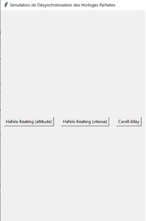
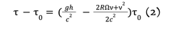
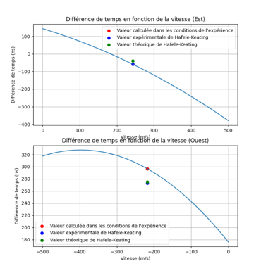
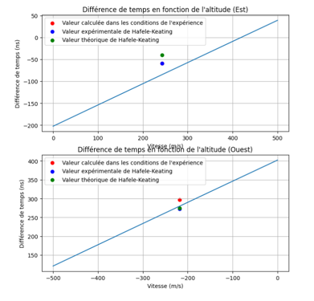
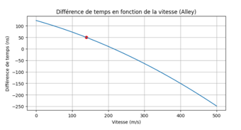

# Simulation G5C - Désynchronisation des horloges parfaites
## Mise en contexte
La simulation suivante à pour but de mettre en évidence les effets **relativistes et gravitationnels** et de comparer 
les résultats théoriques, ce que nous avons avec notre simulation, avec les résultats qui ont été obtenus lors des
expériences de **Hafele et Keating** et de **Carroll Alley**. 

### Présentation
Nous avons décidé de représenter nos résultats sous trois formes: comparés à ceux d'Hafele-Keating en fonction de la 
vitesse de l'avion, comparés à ceux d'Hafele-Keating en fonction de l'altitude de l'avion et comparé à ceux de Carroll Alley. 
Il est possible de choisir quelle représentation on souhaite afficher : 



## Définitions des constantes 
La fonction dilatation_temporelle comporte un grand nombre de constantes qu'il faut implémenter, sachant que la fonction
reçoit en argument l'**altitude**, la **vitesse de vol**, le **temps de vol** et la **latitude** :
 ```python
def dilatation_temps(vitesse, altitude, temps_vol, latitude):
c = 3 * 10**8  # vitesse de la lumière en m/s
vitesseTerre = 1670 / 3.6 # vitesse de rotation de la Terre en m/s
G = 6.67430 * 10 ** (-11)  # constante gravitationnelle en m^3 kg^-1 s^-2
M = 5.972 * 10 ** 24  # masse de la Terre en kg
R = 6371 * 10 ** 3  # rayon de la Terre en m
g = G * M / (R + altitude) ** 2 # accélération de la pesanteur en m/s²
 ```
Cette fonction retourne le décalage temporel, multiplié par le temps de vol. 
Décalage temporel calculé par la formule suivante :



représentée dans le code par la variable delta_t :
```python
delta_t = ((g*altitude) - (vitesseTerre*vitesse*np.cos(latitude*2*np.pi/360)) - (vitesse**2)/2) / (c**2)
```

## Hafele et Keating

Nous commençons par déterminer les conditions de vol, basées sur les notes d'Hafele et Keating : 
```python
# Conditions de vol
temps_vol_est = 41.2 * 3600  # en s pour l'est
temps_vol_ouest = 48 * 3600  # en s pour l'ouest
vitesses_est = np.linspace(0, 500, 50)  # en m/s
vitesses_ouest = np.linspace(-500, 0, 50) # en m/s
altitudes = np.linspace(0,15000,50)

# Valeurs fixes d'altitude et de latitude pour Hafele-Keating
altitude_est = 8900 # en m
latitude_est = 34 # en degré
vitesse_est = 243 #en m
altitude_ouest = 9360 #en m
latitude_ouest = 31 # en degré
vitesse_ouest = -218 #en m/s
```
Puis, nous rentrons ces conditions de vol dans la fonction dilatation_temps, une fois vers l'Est et une fois vers l'Ouest,
pour obtenir les prédictions basées sur les conditions d'Hafele et Keating : 
```python
simu_HK_est = dilatation_temps(vitesse_est, altitude_est, temps_vol_est, 34)
simu_HK_ouest = dilatation_temps(vitesse_ouest, altitude_ouest, temps_vol_ouest, 31)
```
### Résultats 
Pour une meilleure compréhension, nous choisissons de rappeler les résultats réels de Hafele et Keating, ainsi que leurs prédictions: 
```python
HK_est_xp = -59
HK_ouest_xp = 273
HK_est_prediction = -40
HK_ouest_prediction = 275
```
Nous obtenons pour cette simulation le graphique suivant, en comparant avec les prédictions réelles de l'expérience :



On observe que nous sommes très proches des prédictions réelles et des résultats réels car les points les représentants
sont pratiquement sur la courbe tracée. 
Nous avons décidé de représenter aussi les résultats en fonction de l'altitude et les résultats obtenus sont les suivants:



## Carroll Alley 
Nous rappelons les conditions de vol de Carroll Alley : 
```python
temps_vol_alley = 30*3600 # en s
altitude_alley = 10500 # en m
vitesse_alley = 500/3.6 # en m/s
latitude_alley = 37 # en degre, qui correspond à Chesapeake Bay dans le Maryland, lieu de l'expérience
```
Nous obtenons pour ces valeurs les résultats suivants : 



Nous sommes encore une fois proches des résultats attendus car la valeur se trouve sur la courbe. 